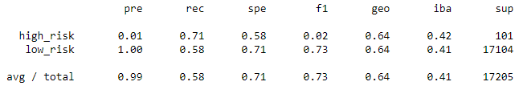
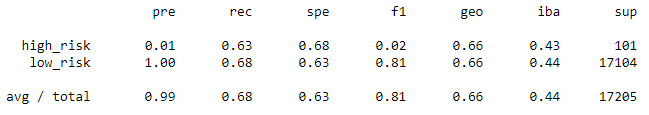
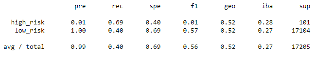
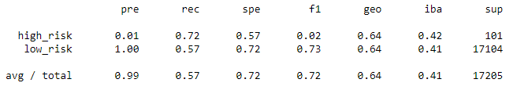
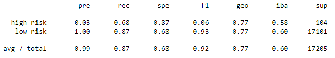
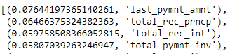
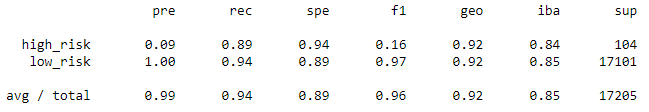

# Analysis of credit Risk using Supervised Machine Learning Models
The project is to predict the credit risk by analysing a dataset, and using several parameters to accurately predict whether or not to lend to the particular individual. As part of the project I did re-sampling to address class imbalance and evaluated 6 different machine learning models
### Dependencies
- Scikit
- Imblearn
- Numpy
- Pandas

Throught the project we evaluated the following models
- Logistic Regression
  - Oversampling
  - SMOTE Oversampling
  - Undersampling
  - SMOTEENN Combination Sampling
- Random Forest Classifier
- Easy Ensemble

The steps involved were boradly similar across all 6 models
1. Read the data and perform basic cleaning
2. Split the data into training and testing datasets
3. Resample the data if required
4. Train the model
5. Evaluate the model by performing various tests
6. Choose the best model to evaluate

## Results
### Random Oversampling
The random oversampling gave an accuracy of **64.63%**. The detailed results of the model can be seen below. As we can see, the precision for high risk is too low which makes the model not ideal for our purpose. The recall of 0.71 and 0.58 are not ideal as well.  
  

### SMOTE Oversampling
This method has an accuracy of **65.8%**. However similar to the random method the precision and recall are both not ideal.  
  

### Undersampling
This method also has an accuracy of **65.8%**. And has the same issues as the previous two methods where both the precision and the recall are poor.
  

### Combination Sampling
Combination sampling lowers the accuracy of the model to **54.47%**. The issues with the previous 3 methods still persist here.
  

### Balanced Random Forest Classifer
The accuracy of this model is improves to **77.6%**. Precision and recall scores improve as well, however this is still not ideal.  
  

If we look at the actual features ranked by their importance, the below 4 features seem to have the highest importance. However none of the new loans will have these features which could be the reason why the precision scores for high_risk is pretty low in this model too.  
  

### Easy Ensemble
The accuracy of this model is **91.7%**. The precision of the high risk is low, however the recall is very good here.
  

## Recommendations
All the above models have a low precision in terms of predicting high risk. The Easy Ensemble method, does have good recall, which makes it the best model here to predict credit risk. However all the models do have an overfit on precision and we may have to add more features, or build a different model to distinguish these features better.

